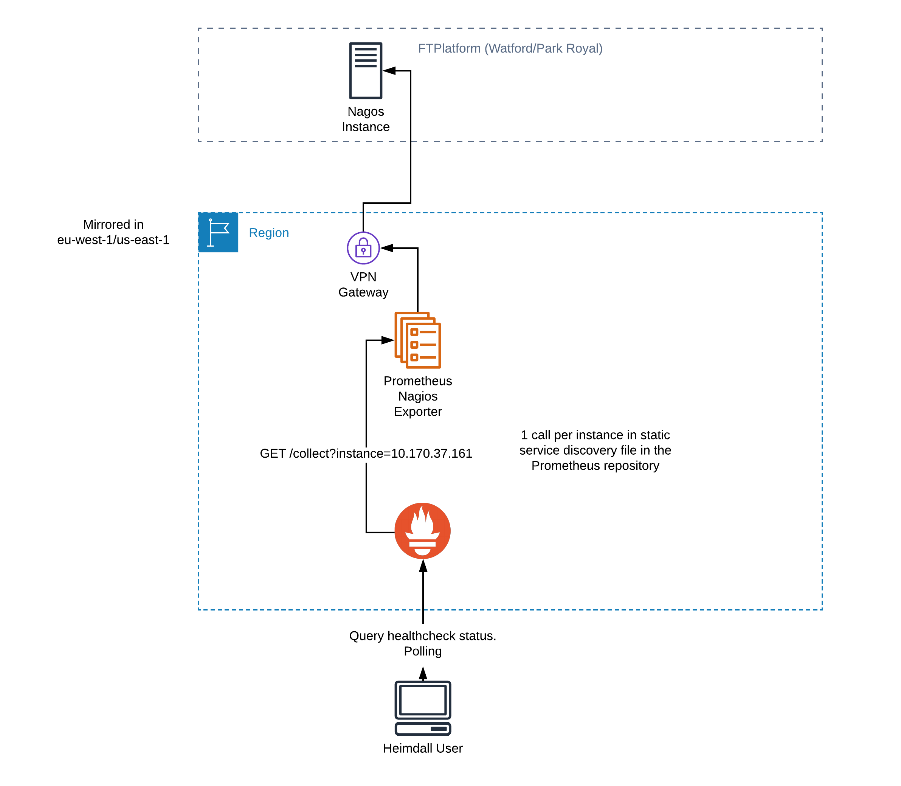

<!--
    Written in the format prescribed by https://github.com/Financial-Times/runbook.md.
    Any future edits should abide by this format.
-->

# Prometheus Nagios Exporter

A HTTP API which scrapes individual nagios instances and returns a response in the Prometheus metrics format, with each Nagios check exposed as a separate metric.

## Primary URL

<https://prometheus-nagios-exporter.in.ft.com>

## Service Tier

Platinum

## Lifecycle Stage

Production

## Host Platform

AWS ECS

## Delivered By

[reliability-engineering](https://biz-ops.in.ft.com/Team/reliability-engineering)

## Supported By

[reliability-engineering](https://biz-ops.in.ft.com/Team/reliability-engineering)

## First Line Troubleshooting

The exporter can be accessed directly either via the [Dyn GSLB](https://prometheus-nagios-exporter.in.ft.com) or in the [EU](https://prometheus-nagios-exporter-eu-west-1.in.ft.com) or [US](https://prometheus-nagios-exporter-us-east-1.in.ft.com) specifically.

There is a [Splunk dashboard for Nagios connectivity issues](https://financialtimes.splunkcloud.com/en-GB/app/search/prometheus_nagios_exporter_scrape_errors) as this is AWS -> FT data centres over a VPN tunnel, and has to go through firewalls `context deadline exceeded` errors in this dashboard indicate a normal timeout error and likely doesn't indicate a connectivity issue.

A few useful queries can be ran to determine what the exporter is returning, if anything. These can be run either in the [Prometheus console](http://prometheus.in.ft.com/) or the [Grafana explore UI](https://grafana.ft.com/explore?left=%5B%22now-6h%22,%22now%22,%22Operations%20%26%20Reliability%20Prometheus%22,%7B%7D,%7B%22ui%22:%5Btrue,true,true,%22none%22%5D%7D%5D).

-   Is the exporter down, or has it been down recently?

    ```promql
    up{job="nagios"} == 0
    ```

    `== 0` for down, `== 1` for up.

    If this is down it suggests either a problem with the connectivity between Prometheus and the exporter, or that the exporter is not responding.

-   Is the Nagios instance down/accessible, or has it been down recently?

    ```promql
    nagios_up{job="nagios"} == 0
    ```

    `== 0` for down, `== 1` for up.

    If this is down it suggests either a problem with the connectivity between the exporter and the Nagios instance, bad credentials between the two, or a problem with the the Nagios instance API.

    There have been issues with connectivity to exporters previously due to firewall rules or VPN issues. By viewing which Nagios instances are affected using the `instance` label, and comparing results for the two AWS regions by making queries in both Prometheus instances it is possible to work out if there is a pattern suggesting firewall/connectivity issues. Splunk is also useful here as the exporter logs the Nagios scrape error.

-   Are the expected checks being fetched in the numbers expected?

    ```promql
    count(nagios_check_status{job="nagios"} == 0)
    ```

    `== 0` for down, `== 1` for up.

View the generic troubleshooting information for the AWS ECS cluster (including services running on the cluster) which the application runs on: [monitoring-aggregation-ecs](https://github.com/Financial-Times/monitoring-aggregation-ecs/blob/master/documentation/RUNBOOK.md).

## Second Line Troubleshooting

Nothing further to add.

## Bespoke Monitoring

The Heimdall Prometheus has some bespoke alarms which are sent to the [#rel-eng-alerts](https://financialtimes.slack.com/messages/C8QL0GY9J) Slack via alertmanager.

These are visible in the [Alertmanager UI](https://alertmanager.in.ft.com/) if they are firing.

There are several Grafana dashboards:

-   [AWS ECS Task metrics](http://grafana.ft.com/d/YCsaeAFiz/aws-ecs-operations-and-reliability?orgId=1&var-region=eu-west-1&var-cluster=mon-agg-ecs&var-service=mon-agg-ecs-service-prometheus-nagios-exporter-Service-1TAK4JS4KJKM6) (`us-east-1` metrics are available using the dropdowns).
-   [Go language runtime metrics](http://grafana.ft.com/d/c0mUzOcmz/go-processes?orgId=1&var-system=prometheus-nagios-exporter&var-cluster_name=All&var-container=prometheus-nagios-exporter-service&var-task_revision=All&var-instance=All&var-interval=10m)

Logs are available in [Splunk](https://financialtimes.splunkcloud.com/en-GB/app/search/search?q=search%20index%3D%22operations-reliability%22%20%09attrs.com.ft.service-name%3D%22prometheus-nagios-exporter-service%22%20attrs.com.ft.service-region%3D%22*%22&display.page.search.mode=verbose&dispatch.sample_ratio=1&earliest=-1d&latest=now) via the query:

```splunk
index="operations-reliability" attrs.com.ft.service-name="prometheus-nagios-exporter-service" attrs.com.ft.service-region="*"
```

There is a [bespoke Splunk dashboard for connectivity issues between the exporter and nagios](https://financialtimes.splunkcloud.com/en-GB/app/search/prometheus_nagios_exporter_scrape_errors). `context deadline exceeded` is a normal timeout error and likely doesn't indicate a connectivity issue.

## Contains Personal Data

False

## Contains Sensitive Data

False

## Architecture

Diagram for the nagios exporter:



[View in Lucidchart](https://www.lucidchart.com/invitations/accept/1c44f0d7-e4fe-4faf-b448-7f773092db92).

Note: This setup is mirrored in `eu-west-1` and `us-east-1` regions.

## Dependents

-   [Heimdall UI](https://biz-ops.in.ft.com/System/heimdall-ui)
-   [Prometheus](https://biz-ops.in.ft.com/System/prometheus)

## Failover Architecture Type

ActiveActive

## Failover Process Type

FullyAutomated

## Failback Process Type

FullyAutomated

## Data Recovery Process Type

NotApplicable

## Data Recovery Details

Not applicable.

## Release Process Type

FullyAutomated

## Rollback Process Type

Manual

## Release Details

Release:

-   Merge a commit to master
-   [CircleCI](https://circleci.com/gh/Financial-Times/workflows/prometheus-nagios-exporter) will build and deploy the commit.

Rollback:

-   Open CircleCI for this project: [circleci:prometheus-nagios-exporter](https://circleci.com/gh/Financial-Times/workflows/prometheus-nagios-exporter)
-   Find the build of the commit which you wish to roll back to. The commit message is visible, and the `sha` of the commit is displayed to the right.
-   Click on `Rerun`, under the build status for each workflow
-   Click `Rerun from beginning`

## Key Management Process Type

Manual

## Key Management Details

The systems secrets are set at build time as parameters in the services Cloudformation template.

They come from two sources:

1. The CircleCI environment variables for the CircleCI project.
2. The CircleCI context used in the [CircleCI config](./circleci/config.yml).

See the [README](./README.md) for more details.
